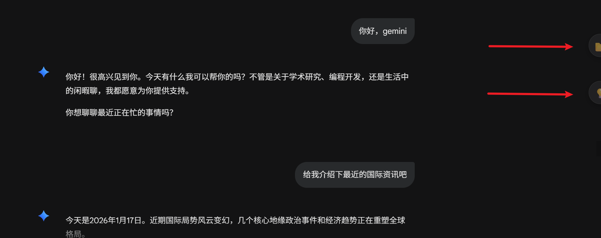
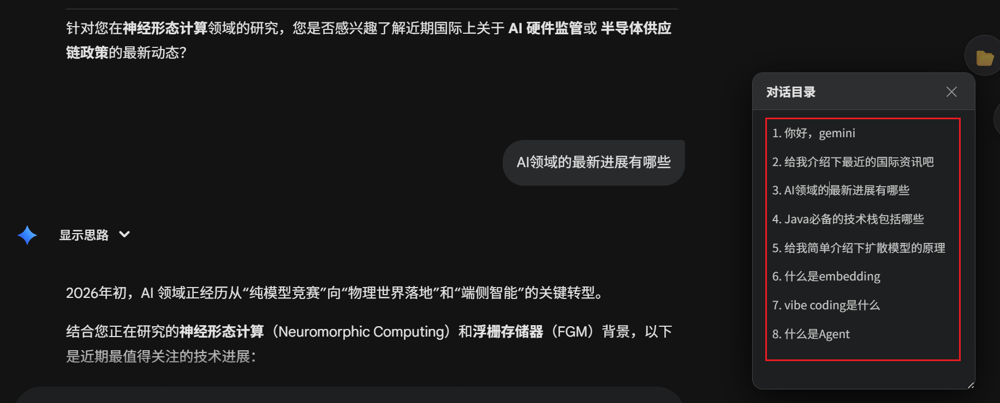
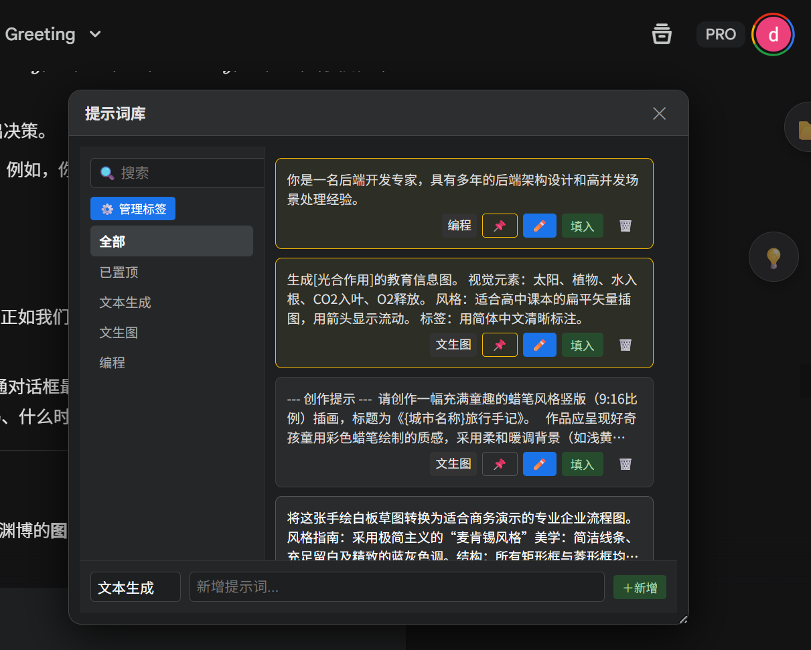
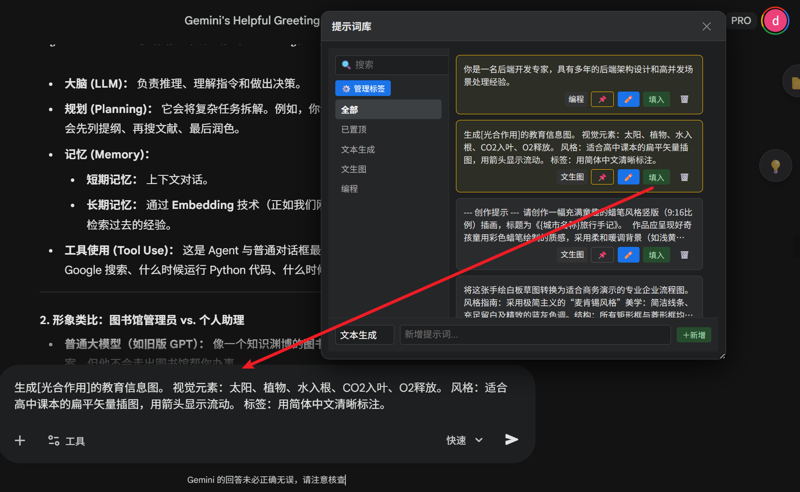
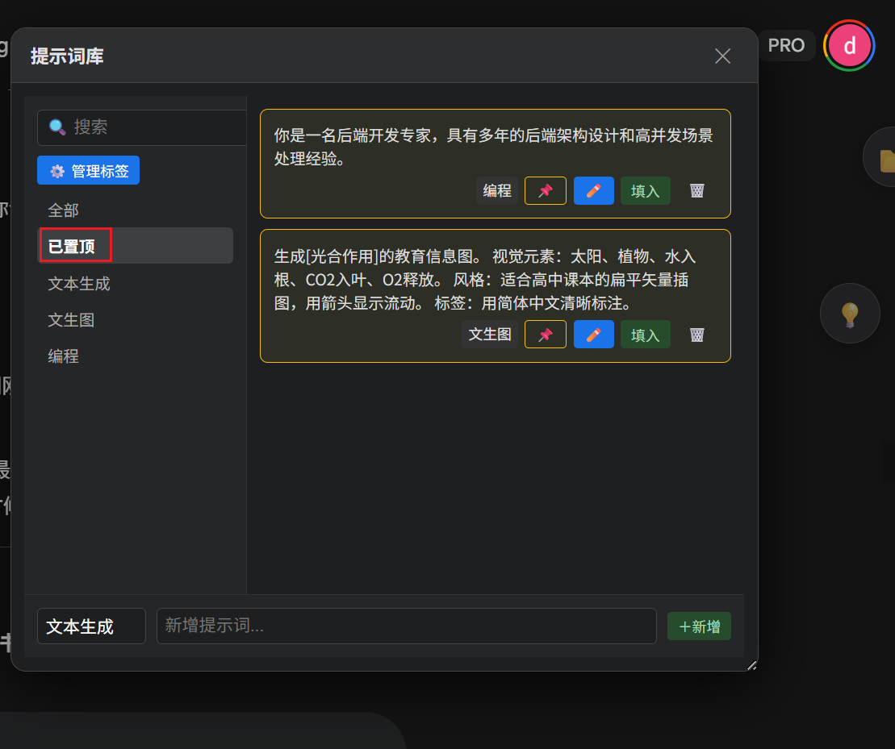
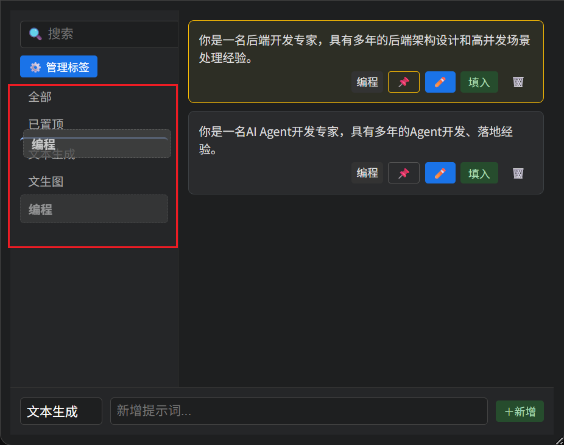
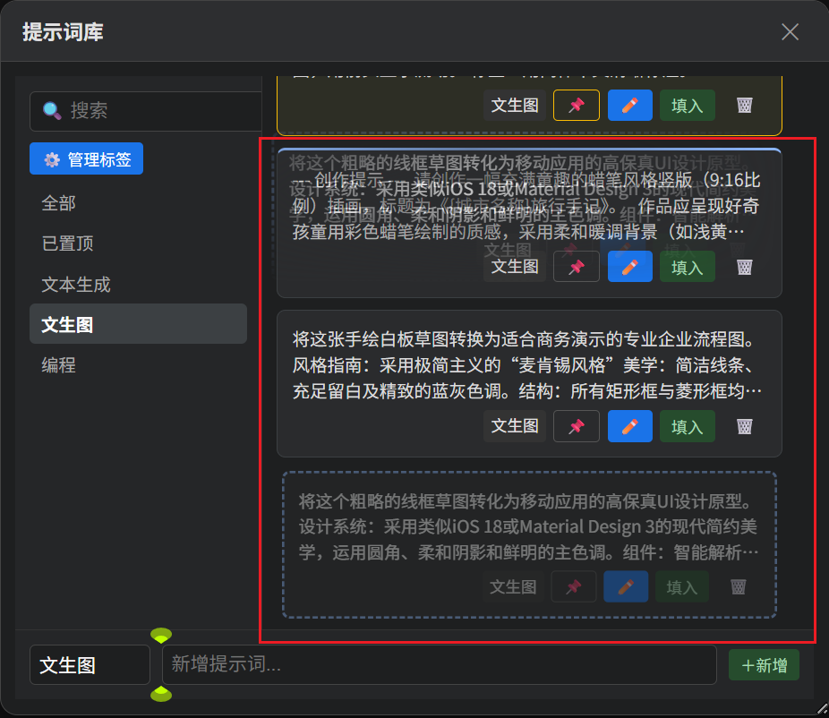
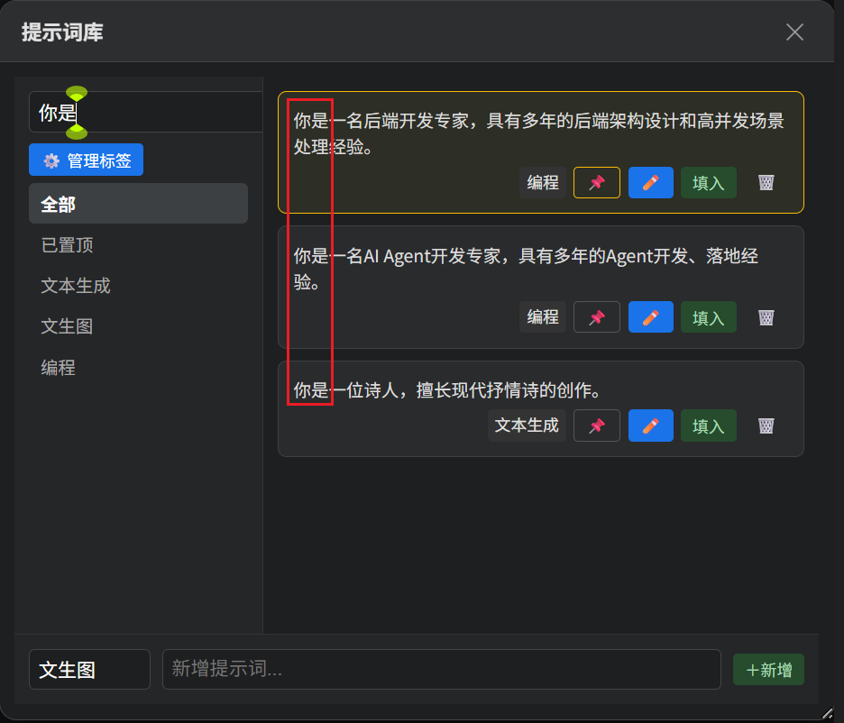
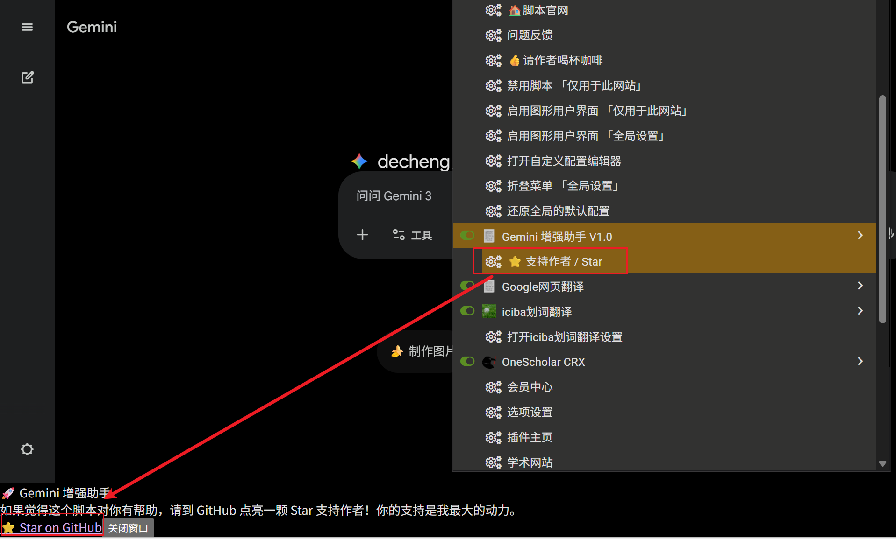
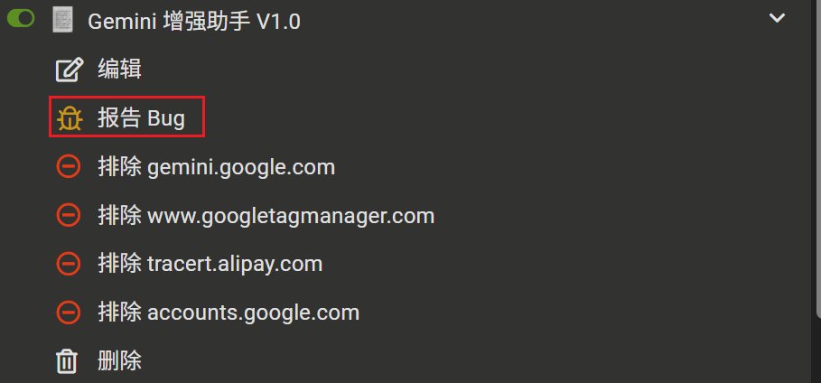

# 🚀 Gemini Enhancer (Gemini 增强助手V1.0)

<strong>专为 Google Gemini 网页版打造的极致体验增强脚本</strong>

    
        <strong>
            <a href="https://greasyfork.org/zh-CN/scripts/563034-gemini-%E5%A2%9E%E5%BC%BA%E5%8A%A9%E6%89%8B-v1-0">脚本安装</a> | 
            <a href="https://github.com/Mrchen-1600/Gemini-Enhancer/blob/main/README.md">使用说明</a> |
            <a href="https://github.com/Mrchen-1600/Gemini-Enhancer/issues">问题反馈</a>
        </strong>
    

<strong>如果这个脚本对你有帮助，请点击右上角的 ⭐ Star 支持一下！感谢！</strong>

## 📖 简介

**Gemini Enhancer** 是一款功能强大的 Tampermonkey (篡改猴) 脚本，旨在解决 Google Gemini 网页版使用过程中的痛点。

功能包括：**无痕去除图片水印**、**长对话目录跳转**、**常用提示词管理**，通过右侧优雅的半隐藏式悬浮按钮进行使用。

## ✨ 核心功能

### 1. 🖼️ 无痕去除图片水印 

告别 Gemini 生成图片默认带有的右下角水印。采用 **拉伸模糊 (Stretch-Blur)** 算法，完美保留背景纵向渐变，无鬼影，速度快。

⚠️：针对水印附近颜色/图案简单的图片去水印效果较好，如果水印附近出现文字/复杂图案，生成效果不佳。

**使用方式**：单击生成的图片，图片右上角将自动出现 **“去水印保存”** 按键，单击按钮即可自动去水印保存图片。

          

### 2. 📂 长对话目录跳转

长对话的导航救星。

- **自动生成**：实时抓取当前会话的所有提问，生成侧边目录。
- **智能滚动**：采用 Diff 检测技术，目录刷新时页面不回弹，体验丝滑。
- **自由拖拽**：目录面板可随意拖动、吸附屏幕边缘，支持记忆位置和大小。

### 3. 💡 提示词仓库与标签管理

打造你的私人 Prompt 仓库。

- **拖拽排序**：支持标签、提示词卡片的手动拖拽排序。

- **标签管理**：支持创建、重命名、删除标签组。

- **快捷操作**：支持搜索、置顶常用提示词、一键填入输入框。

- **防误触**：优化的编辑窗口逻辑，防止误操作关闭。

  

**提示词仓库：**

**一键填入对话框：**

**可将常用提示词置顶，便于快速使用**：

**可移动标签组顺序（全部和已置顶不可移动）：**

**提示词顺序同样可移动：**

**支持关键词检索已创建的提示词**：

## 📦 安装方法

1. **安装管理器**：确保你的浏览器已安装 [Tampermonkey](https://www.google.com/search?q=https://www.tampermonkey.net/) 扩展。

2. **安装脚本**：
   
   - **方式 A (推荐)**：[点击此处安装脚本](https://greasyfork.org/zh-CN/scripts/563034-gemini-%E5%A2%9E%E5%BC%BA%E5%8A%A9%E6%89%8B-v1-0) 
   - **方式 B**：前往 [Greasy Fork](https://greasyfork.org/zh-CN) 搜索 "Gemini 增强助手 V1.0" （作者：Mrchen1600）进行安装。
   
3. **刷新页面**：打开 [Gemini](https://gemini.google.com/app)，你应该就能看到右侧的悬浮按钮了。

   

## ⚙️ 支持作者

**如果你觉得本脚本好用，希望可以给作者点上一个小小的🌟，你的支持是我最大的动力。**

**如果你在使用过程中，发现任何Bug，欢迎进行反馈**。

## 📄 免责声明

本脚本仅供学习与交流使用。脚本中涉及的去水印功能仅用于个人使用与非商业用途，请尊重原图版权。本脚本与 Google 公司无关。

 Made with by <a href="https://github.com/Mrchen-1600">Mrchen</a> 

